# Facial Recognition and Layout Generation for Product ADs
## Project Overview
   This project focuses on combining demographic analysis with a layout generation system to create more intelligent and context-aware visual designs. The demographic analysis component studies user characteristics such as age group, gender, ethnicity, and emotion for mapping the target audience for the generation of ADs. The layout generation module functions based on the 2-stage CoT(Chain of Thought) prompting technique where stage 1 contains placement plan containing logo, text1, text2, underlay in Natural Language format and stage 2 contains the element coordinates (x, y, w, h) in decimals along with the placement plan from stage 1 and outputs the image in HTML format. The layout generated image contains product name, call to action, price, and discount ensuring prominence, readability, and alignment with user expectations. To evaluate the system performance, metrics like overlap, alignment, utility, validity, occlusion, iou, and readability where implemented to ensure consistency. To evaluate the performance of the recommendation system, the comparison study was made with Movielens dataset which contains ratings and user data. Evaluation Metrics used - Hit Rate (HR) to measure how often movies appear in top n recommendations, NDCG (Normalized Discounted Cumulative Gain) to assess the quality and ranking of movies based on importance, and MRR (Mean Reciprocal Rank) to evaluate how quickly the most relevant element appears.
## Prerequisite
  Python\
  Add these python libraries in requirements.txt\
  NumPy – numerical computations\
  Pandas – data manipulation (datasets, demographic analysis)\
  Matplotlib – basic plotting (graphs, metrics)\
  Seaborn – advanced statistical visualization\
  scikit-learn – for metrics, preprocessing, evaluation\
  SciPy – statistical analysis\
  Pillow (PIL) – image creation and editing\
  OpenCV – advanced image processing\
  Pytorch / Tensorflow\
  Securely store API keys secretly in .env file
## Outputs
Demographic Analysis of different age groups.\
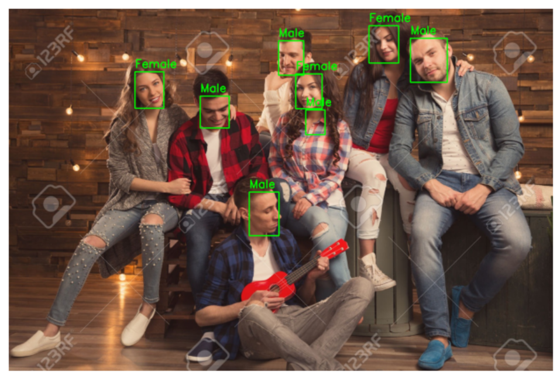

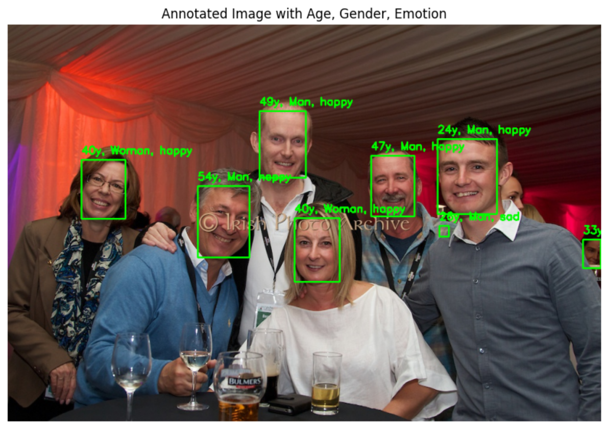

Sample Layout Image for Products.\
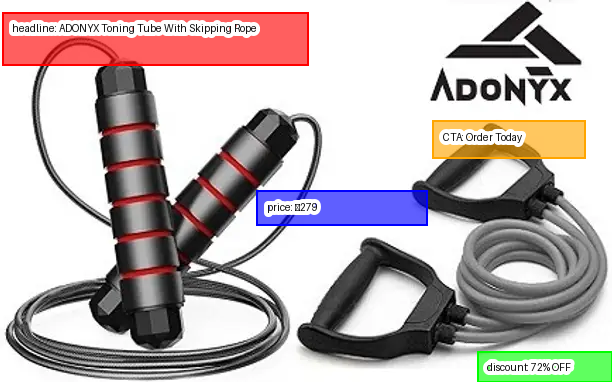

Sample Layout Images for different shot prompting (0, 5, 10).\
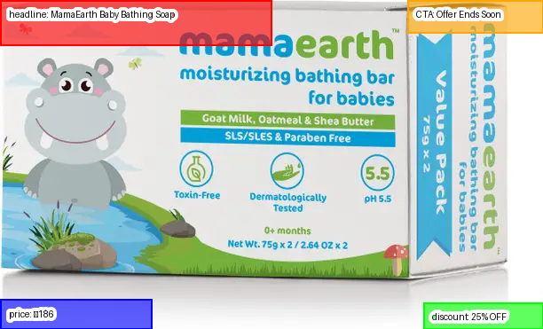
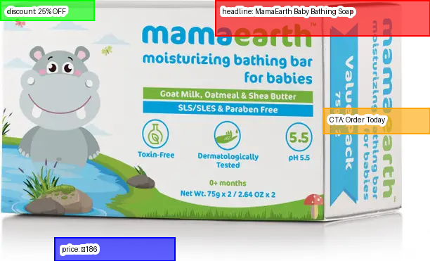
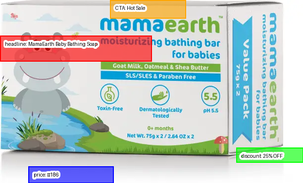

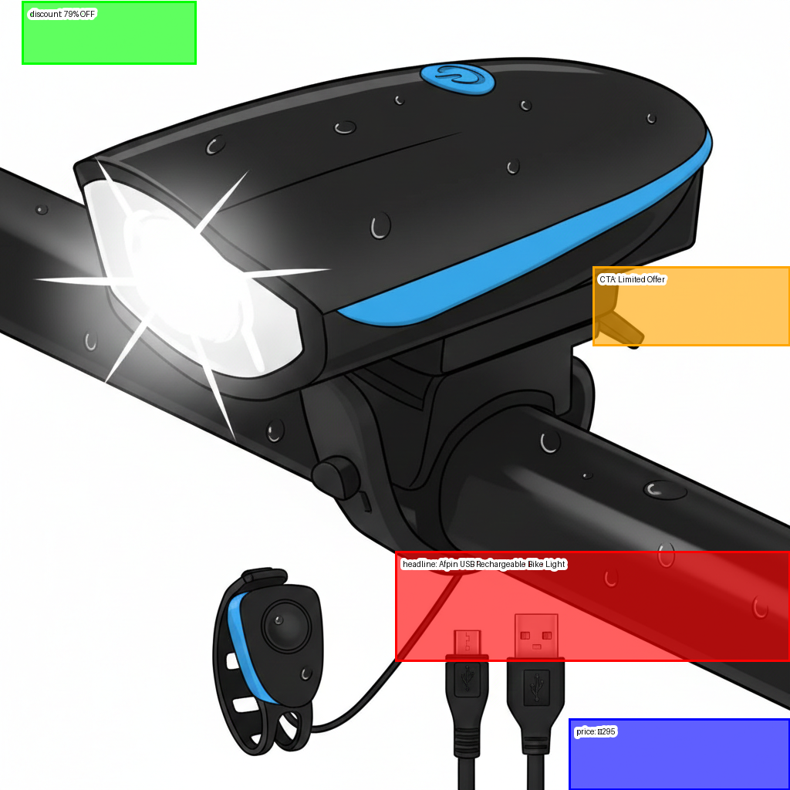
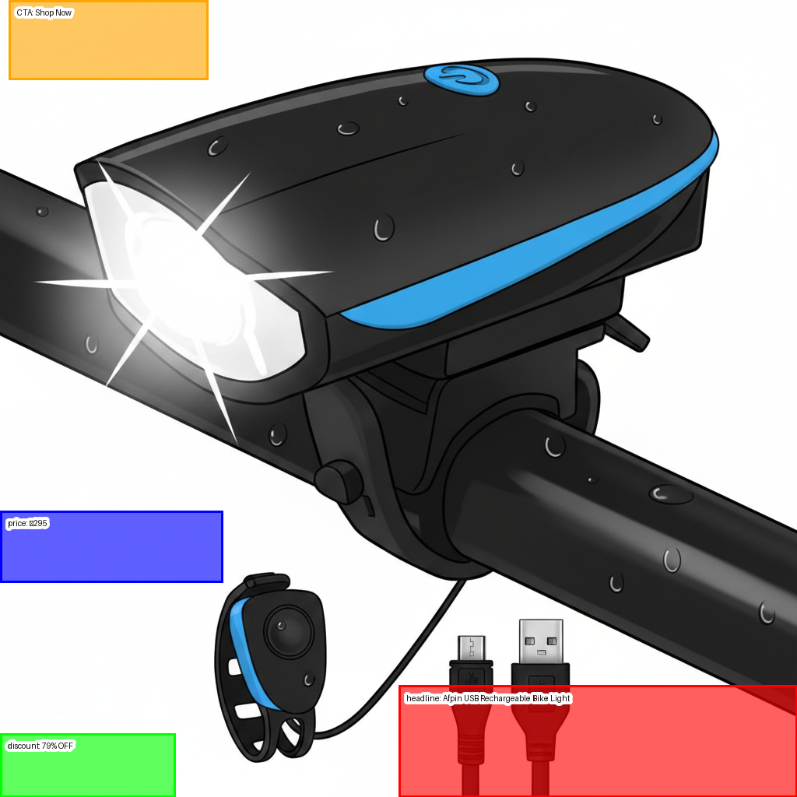
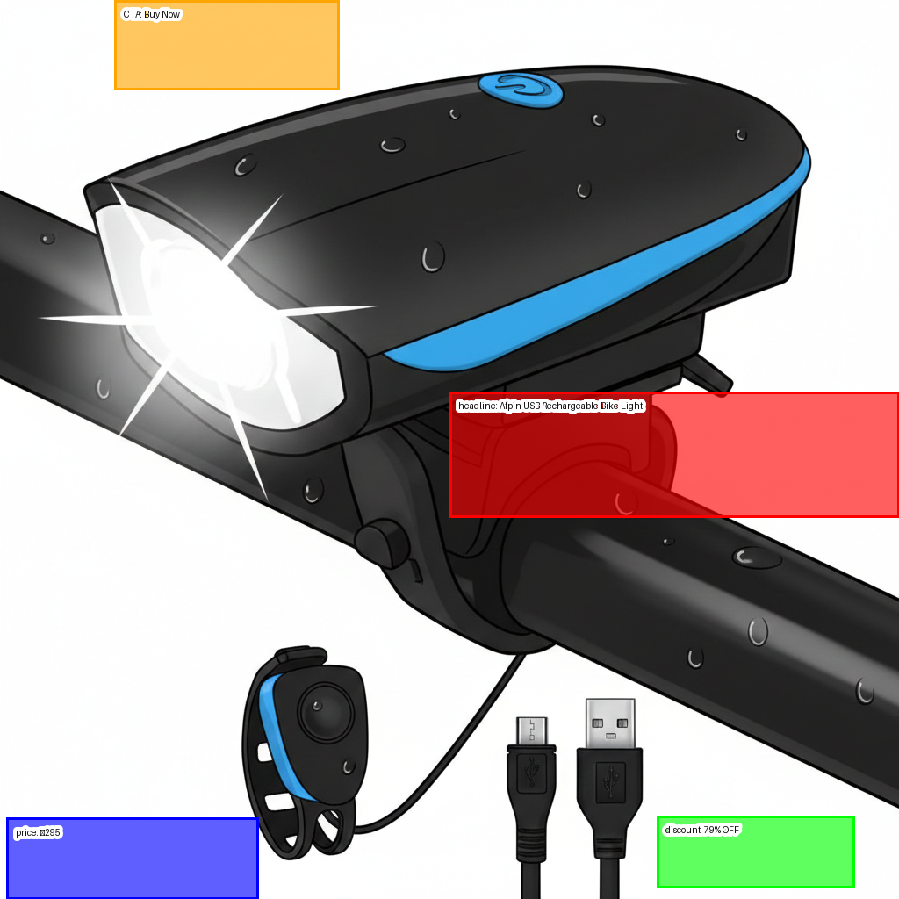

Radar Plot and Bar chart for 0, 5, 10 shot prompting.\
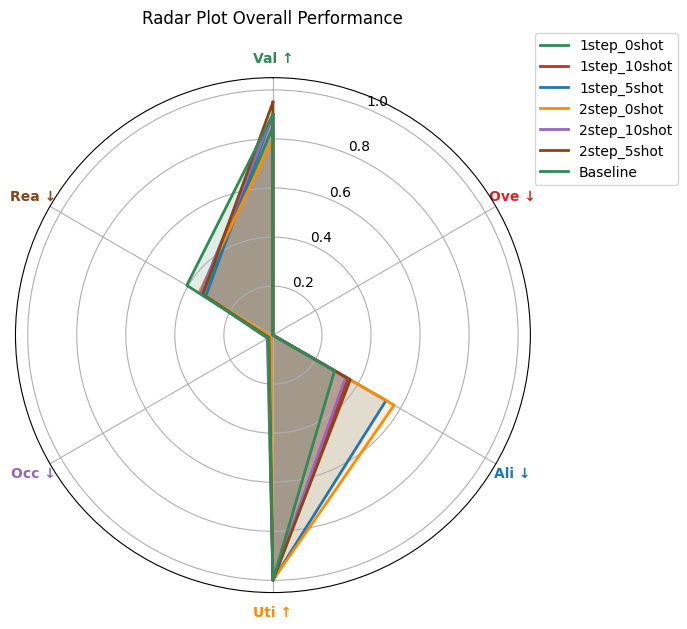
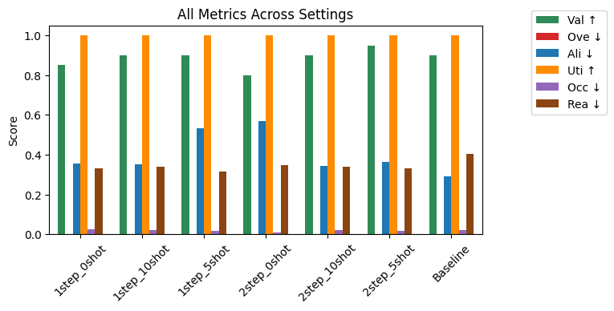
